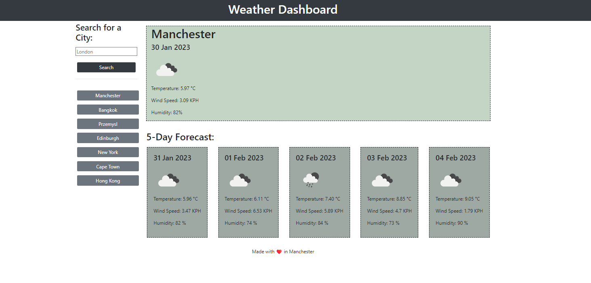

# Weather-Dashboard - Bootcamp Week 8

## Server APIs: Weather Dashboard

This project displays the weather for any chosen city, dynamically updating the page with data provided by OpenWeather API. The city can be chosen from existing options, or upon searching for a new city a button is created and appended to the list. This is then saved in local storage.

The app does the following:

When a user searches for a city they are presented with current and future conditions for that city and that city is added to the search history.

When a user views the current weather conditions for that city they are presented with:

- The city name

- The date

- An icon representation of weather conditions

- The temperature

- The humidity

- The wind speed

When a user views future weather conditions for that city they are presented with a 5-day forecast that displays:

- The date

- An icon representation of weather conditions

- The temperature

- The humidity

When a user clicks on a city in the search history they are again presented with current and future conditions for that city.

## Usage

Here is a mock up of the page:

 

## Credits

[Assignment] https://courses.bootcampspot.com/courses/3021/assignments/44746?module_item_id=832436 
[OpenWeather API] https://openweathermap.org/api

## Link to deployed application

https://sonia-deni.github.io/Weather-Dashboard/

## License

This project is licensed under the MIT License

## Badges

